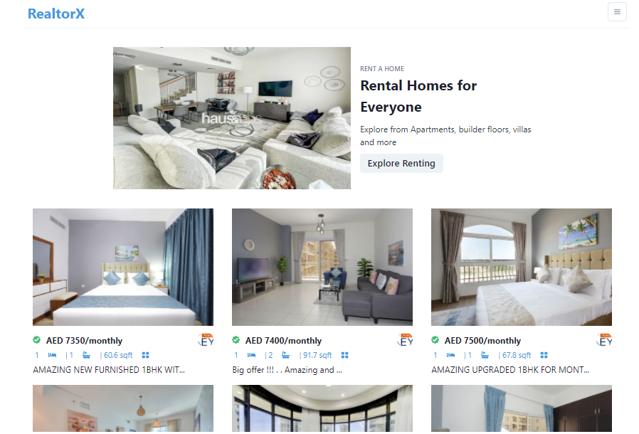

## Demo

[View project live demo](https://real-estate-ekidhaja.vercel.app/)

## Description

The goal of this project is to allow visitors to explore real estate in the UAE. It fetches real estate data from [Bayut API](https://rapidapi.com/apidojo/api/bayut/) hosted on the world's larget APIs hub [Rapid API Hub](https://rapidapi.com/). The App is fully responsive and displays well on mobile devices too.

## Features

The app has the following features:

- List properties - Displays various properties based on certain criteria.
- Search Filter - You can search for properties by various criteria like min price, type (for rent, for sale), beds, baths, etc.
- Property details - Click on a property and view all its details like images, amenities, agent, etc.

## Tech Stack

- [React JS](https://reactjs.org/) - For frontend.
- [Next JS](https://nextjs.org/) - For frontend, routing.
- [Chakra UI](https://chakra-ui.com/) - For UI components and styling.

